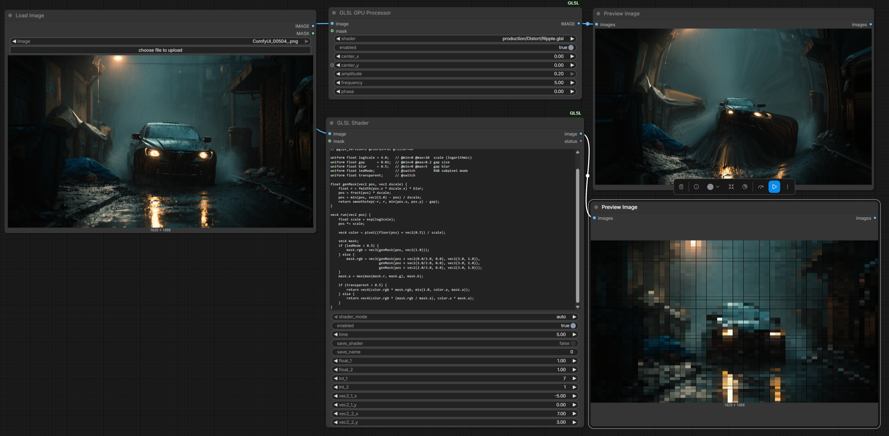
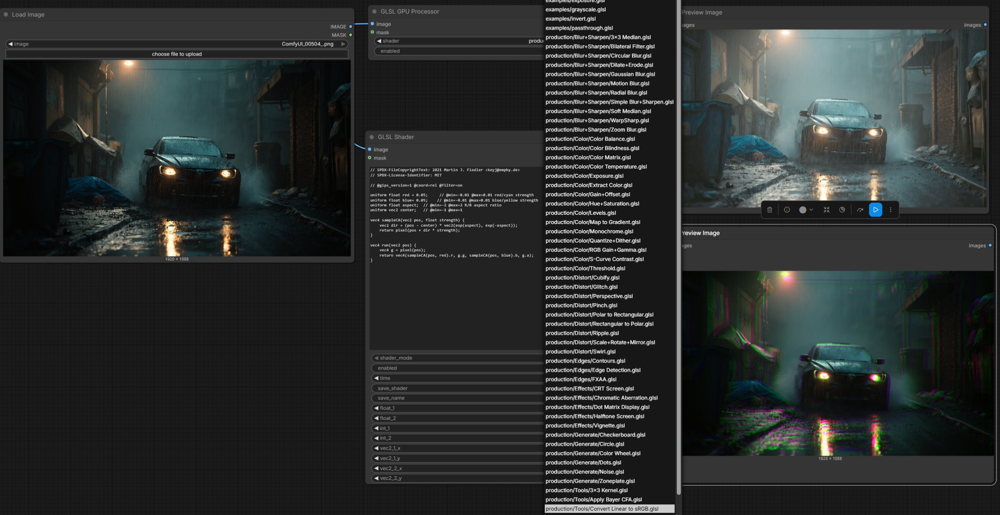
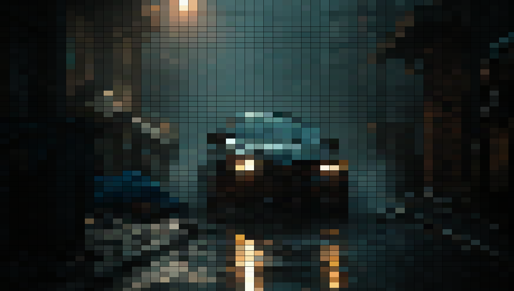
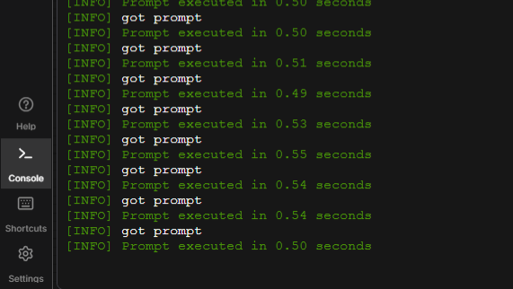

# ComfyUI-GLSL

GPU-native GLSL image processing for ComfyUI, driven by a Vulkan compute backend (GLSL → SPIR-V via `glslc`).

This is separate from ComfyUI’s built-in GLES fragment GLSL nodes. It runs compute shaders on the GPU and is built for **wide-range shader compatibility**: paste or load filters from many ecosystems with little or no rewriting — including **GIPS**, GLES/WebGL fragment shaders, GLSL Sandbox, Processing TextureShaders, and native simple/Vulkan compute styles.

## Screenshots

Input image:


GLSL GPU Processor + GLSL Shader in a ComfyUI graph (library Ripple filter and inline shader):



Production/GIPS preset library in the Processor dropdown:



Chromatic aberration (GIPS effects filter):


Ripple / swirl distort:


Dot-matrix / mosaic style effect:



Typical prompt times (~0.5s per run on a discrete GPU):



## Nodes

| Node | Role |
|------|------|
| **GLSL GPU Processor** | Run a `.glsl` from the shader library. Uniforms for the selected shader appear automatically. |
| **GLSL Shader** | Inline authoring / paste-and-run. Fixed tweak slots only (not the full library parameter set). |
| **GLSL GPU Diagnostics** | Reports Vulkan device / backend status. |

Both Processor and Shader share the same runtime (parse → adapt → compile → dispatch).

## Shader library

Shaders live under `shaders/`:

| Folder | Purpose |
|--------|---------|
| `shaders/examples/` | Small built-in demos (passthrough, invert, grayscale, exposure) |
| `shaders/production/` | Production filters, including the full **GIPS** shader set |
| `shaders/user/` | Saved inline shaders |

### GIPS filters

The production library includes the shader collection from **[GIPS (GLSL Image Processing System)](https://github.com/kajott/GIPS.git)** by Martin J. Fiedler — blur/sharpen, color, distort, edges, effects, generate, and tools filters (MIT). Layout and format follow [GIPS ShaderFormat](https://github.com/kajott/GIPS/blob/main/ShaderFormat.md) (`run()` / `run_passN()`, `pixel()`, `@coord`, `@filter`, `uniform` + `// @min=` annotations).

Credit: [kajott/GIPS](https://github.com/kajott/GIPS.git).

## Supported shader dialects

Wide compatibility across fragment and compute dialects. Auto-detected when possible (`shader_mode: auto` on the Shader node):

1. **Simple compute** — `vec4 process(vec4 color, ivec2 pixel)` with optional `/* @uniform … */` metadata  
2. **Vulkan compute** — full `#version 450` compute shaders  
3. **GLES / WebGL2 fragment** — `#version 300 es`, `fragColor`, etc.  
4. **WebGL1 / GLSL Sandbox** — `varying`, `texture2D`, `time` / `resolution` / `mouse`  
5. **Processing TextureShaders** — `PROCESSING_TEXTURE_SHADER`, `vertTexCoord`, `texOffset`  
6. **GIPS** — `@gips_version`, `run` / `run_pass1..4`, `pixel()`, multipass  

Dialect adapters rewrite sampling and uniforms into Vulkan compute + push constants so the same runtime can execute all of the above.

## Features

- Vulkan compute path with `glslc` SPIR-V compilation and pipeline caching  
- Discrete GPU preferred when multiple devices are present  
- RGBA32F storage images; Comfy `IMAGE` tensors (`[B,H,W,C]`) in/out  
- Optional mask input  
- **Processor**: dynamic UI — only uniforms for the selected library shader are shown (GIPS `uniform` lines and `@min`/`@max`/`@toggle`/`@angle` included)  
- **Shader**: compact controls — `time`, `float_1`/`float_2`, `int_1`/`int_2`, `vec2_1`/`vec2_2` (`params.float_1`, …)  
- Save inline shaders into `shaders/user/`  
- Multipass GIPS filters run as sequential compute passes  

## Requirements

- ComfyUI with a working GPU  
- [Vulkan SDK](https://vulkan.lunarg.com/) with `glslc` on `PATH` (or discoverable)  
- Python package: `vulkan` (see `requirements.txt`)

```bash
cd ComfyUI/custom_nodes
# clone or copy this package as ComfyUI-GLSL
pip install -r ComfyUI-GLSL/requirements.txt
```

Restart ComfyUI after install. Hard-refresh the browser if the Processor’s dynamic widgets do not update.

## Usage

### GLSL GPU Processor

1. Connect an image (optional mask).  
2. Pick a shader, e.g. `production/Color/Exposure.glsl` or `examples/invert.glsl`.  
3. Tweaks for that shader’s uniforms appear on the node; run the graph.

### GLSL Shader (inline)

Paste or write a shader, set mode to `auto` (recommended), and use the fixed slots in GLSL as `params.float_1`, `params.vec2_1`, etc.

Simple-mode example:

```glsl
/*
@name Inline
@description Mix toward invert using float_1
@version 1.0.0
@input image IMAGE
*/
vec4 process(vec4 color, ivec2 pixel)
{
    color.rgb = mix(color.rgb, 1.0 - color.rgb, clamp(params.float_1, 0.0, 1.0));
    return color;
}
```

GIPS / Processing / WebGL pastes are adapted automatically when detected.

### Optional metadata (`@uniform`)

For simple-mode library shaders you can still declare uniforms in a leading comment block:

```glsl
/*
@name Exposure
@uniform exposure float 0.0 min=-10 max=10 step=0.01
*/
```

GIPS-style `uniform float ev; // @min=-5 @max=5` is discovered without that block.

## Architecture

```text
ComfyUI nodes (Processor / Shader / Diagnostics)
        │
        ▼
  GLSL Runtime  — parse, dialect adapt, glslc, cache
        │
        ▼
  Vulkan backend — storage images, push constants, dispatch
```

Nodes orchestrate inputs and UI; the runtime owns compilation and execution.

## License

MIT for this package.

Bundled **GIPS** shaders remain under their original MIT license; see [GIPS LICENSE](https://github.com/kajott/GIPS/blob/main/LICENSE.txt) and SPDX headers in each file.
